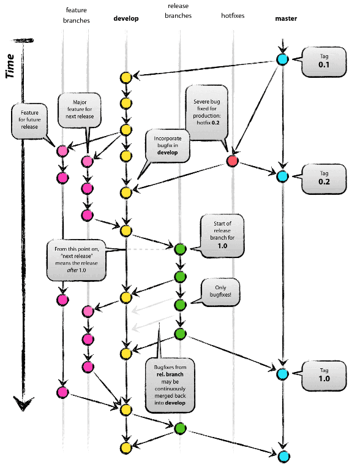
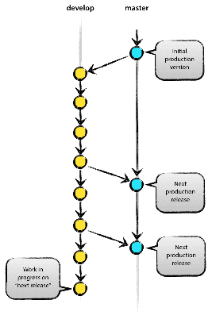
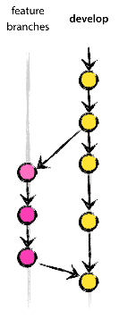
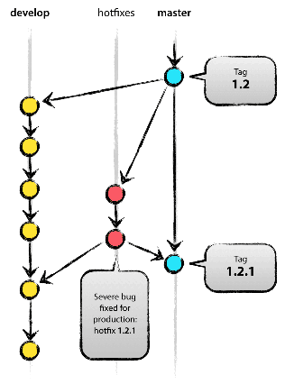

## Git Branching Policies:
# Git Flow

## Introduction:
If you are new to git and/or to repository management, you have probably never heard of branching policies or what a branching policy is.

A branching policy is a set of rules which help organise, keep everything in your repository working as intended, make parallel development easier and make solving any issue related to project structure easy to solve. Using good policies has proven to greatly improve team output when paired with good coordination.

In this page we are going to talk about the 'Git Flow' model, which was depeloped from the [initial proposal by Vincent Driessen](http://nvie.com/posts/a-successful-git-branching-model/).


***

## Basic Structure:

Using Git Flow your repository branching structure should look something like this:



In this image each dot represents a comit to a branch and its color represents the category of the branch. 

But don't be afraid, it's simpler than it looks.

### Master & Develop

The Git Flow workflow consists of two main branches: **```master```** and **```develop```**.



```master``` contains every release of the project only, while ```develop``` is dynamic and contains the "current" state of the project at any given time (with exceptions).

These two branches will be existent from the start of the development and should not be worked on directly most of the time, instead, modifications and new features may be developed in separate branches (named with the prefix ```feature```) and, after they are finished and verified, merged into ```develop```.

In ```develop``` only core features and improvements on already existing ones should be developed, there can be some exceptions, though.

### Features

Each new behaviour of our project should be developed in separate branches which branch off of ```develop```. These branches are called **```feature```** branches.



These branches are used to isolate **single feature issues** and stop them from spreading, getting tangled up, or getting "buried" by the rest of the (supposedly well done and tested) code. This allows us to narrow down the search of causes for bugs aswell as promoting an encapsulated view of the project in which interdependencies between features are minimized.

```feature``` branches may even only be local branches and only appear reflected in the central remote repository when, once the feature is completed, merged with the main ```develop``` branch after it is tested and validated.

Thus, this model allows us to develop independent features without the risk of two or more developers messing with eachother's code or even being succeptible to crashes or bugs caused by others.

### Releases

Whenever we consider the state of the development ready for a certain release, a new branch named after the release (**```release-X.X.X```**) should be created. From there the release must be validated, and any issues found should be fixed and commited to said release branch as well.

Once the release is considered valid, it is merged into the ```master``` branch and tagged with its version number so that it can be easily tracked if needed. At the same time, all changes done on the ```release``` branch shall, aswell, be merged into ```develop``` for further development.

### Hotfixes

If by any circumstances an already released (live) build of our software were to have any critical issue that required an urgent fix, a new branch called **```hotfix```** may be branched from said release (which can be found in the correspondent tag in the ```master``` branch).



In this new branch the issue must be fixed and validated before merging it back to both ```master``` (Updating the already released build) and ```develop``` (To include the fix in future releases). It should be noted that merging the fix back to the ```release``` branch is not needed, since that branch may very well be outdated by the time the hotfix rolls out, and should not be used in the development of the software after the release is completed anyway.


***

## More Information & References:

I thoroughly recommend using [Atlassian Sourcetree](https://www.sourcetreeapp.com/) as your git gui client, works perfectly and supports Git Flow quick setup.

###### [Original idea by Vincent Driessen](http://nvie.com/posts/a-successful-git-branching-model/)

###### [Quick Setup Guide by Daniel Kummer](https://danielkummer.github.io/git-flow-cheatsheet/)

###### Example Repositories: [Example 1](https://github.com/marc094/GitFlowTest) & [Example 2](https://github.com/marc094/GitFlowClass)
